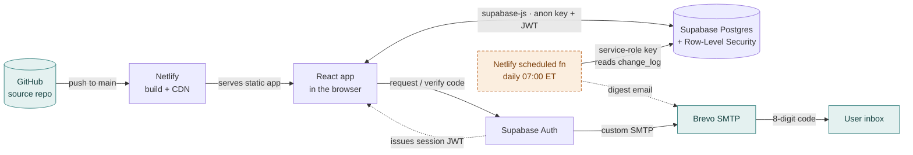
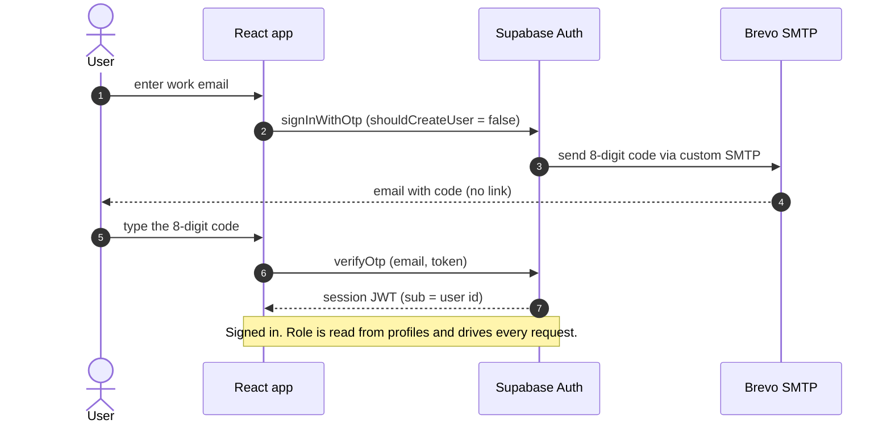
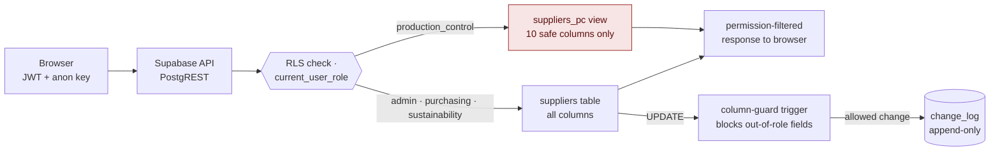
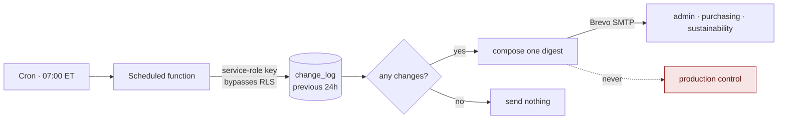
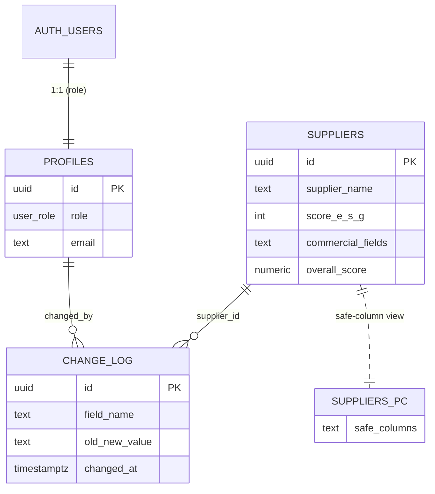

# Supplier ESG Register — System Architecture

**Live app:** https://supplier-esg-register.netlify.app
**Shareable visual version:** https://claude.ai/code/artifact/4c8b9806-782c-434d-b710-4f861719cca3
**Tier:** 3 — login required, roles see and edit different things, data persists to Supabase.

> This maps every component and how data flows between them. GitHub renders the
> Mermaid diagrams below automatically. A styled, standalone version is at
> `docs/architecture.html`, and the same page is published as a shareable
> Artifact (link above).

---

## The whole system

Solid arrows are live paths in production today. The dashed amber box (the daily
digest function) is specified but **not yet built**.

**Legend:** core/production nodes are plain · teal = external service · amber dashed = planned, not built.

---

## Components — what each part is, and what it holds

| Component | Role | Holds (keys/secrets) |
|---|---|---|
| **React app (browser)** | Vite + Tailwind SPA: sign-in, register, role-aware detail, user management, archive, CSV export. Talks to Supabase via `supabase-js`. | Supabase URL + **anon key** (public, browser-safe) and the signed-in user's **JWT**. Nothing privileged. |
| **Netlify** | Serves the static build on its CDN; rebuilds from GitHub `main`. Intended host of the scheduled digest fn. | Env vars: `VITE_SUPABASE_URL`, `VITE_SUPABASE_ANON_KEY` (build); `SUPABASE_SERVICE_ROLE_KEY` + `BREVO_SMTP_*` (reserved for the digest fn). |
| **GitHub** | Source repo. Push to `main` → Netlify build. | Code and docs only — never a key. |
| **Supabase Postgres** | `profiles`, `suppliers`, `change_log` + the `suppliers_pc` view. RLS on every table; triggers enforce column rules and write the audit log. | The real security boundary — decides rows/columns read and fields edited. |
| **Supabase Auth** | Email one-time **8-digit code**, invite-only, self-signup disabled. Sends codes via Brevo; issues session JWT. | Brevo SMTP creds entered in the Auth dashboard (not an env var). |
| **Brevo SMTP** | Outbound relay on the authenticated `lcaresource.com` domain (`smtp-relay.brevo.com:587`). Serves Auth login codes and the planned digest. | SMTP login + key — in the Supabase Auth dashboard and (for the digest) Netlify env. Never in the repo. |
| **Scheduled digest fn** *(planned, not built)* | Daily 07:00 ET: read last 24h of `change_log`, compose one digest, send to admin/purchasing/sustainability only — never production control, nothing on empty days. | Would use the **service-role key** (bypasses RLS) — which is why it lives server-side, never in the browser. |

---

## Data flow 01 — Authentication (the login code)

No password, no clickable link (enterprise mail scanners consume single-use
links before the recipient clicks). The tool emails a code the user types in.

Invite-only is enforced by `shouldCreateUser: false` — an uninvited address gets
the same neutral message and no code, so the screen never reveals who is registered.

---

## Data flow 02 — Reading & writing (where authorization happens)

Every request carries the user's JWT. **Postgres — not the interface — decides**
what comes back and which edits are allowed. The React app mirrors these rules
only for convenience.

The **CSV export** is browser-only: it serializes the exact rows the user already
holds, so restricted columns are **absent from the file**, not blanked — the same
permission-filtered source as the screen.

---

## Data flow 03 — Daily digest *(planned, not built)*

The one remaining arm. Fully specified, not yet implemented; included so the
picture is complete.

**Why it needs the service-role key:** composing the digest means reading the
change log across *all* users, which bypasses RLS. That key is all-powerful, so
it lives only in this server-side function. Production control is excluded because
a digest would carry field changes they are not permitted to see.

---

## Trust boundaries — where every key lives

The browser is untrusted; the security boundary is Postgres RLS. Credentials are
placed by that principle.

| Credential | Stored in | Used by | Power |
|---|---|---|---|
| **Anon / publishable key** | Browser build · Netlify env | Frontend | Public, browser-safe. Every request still bounded by RLS. |
| **User session JWT** | Browser session | Frontend | Acts as one specific user — that role and nothing more. |
| **Service-role key** | Netlify env · digest fn only | Planned digest fn | **Bypasses all RLS.** Never in the browser or any user-facing path. |
| **Brevo SMTP login + key** | Supabase Auth dashboard; Netlify env for the digest | Supabase Auth · digest fn | Sends email as the authenticated `lcaresource.com` domain. |

**The rule that keeps the model honest:** the service-role key never crosses into
the browser. Everything a user touches goes through RLS; only the isolated server
function is trusted to read across users.

---

## Data model

Three tables and one view. The view is the mechanism that hides restricted columns
from production control at the database.

`change_log` is written only by a trigger and has no insert/update/delete policy
for any role — append-only, even for admin. `overall_score` is a generated column,
never entered or seeded.

See `docs/supabase-setup.md` for the authoritative schema, RLS policies, and
triggers.
